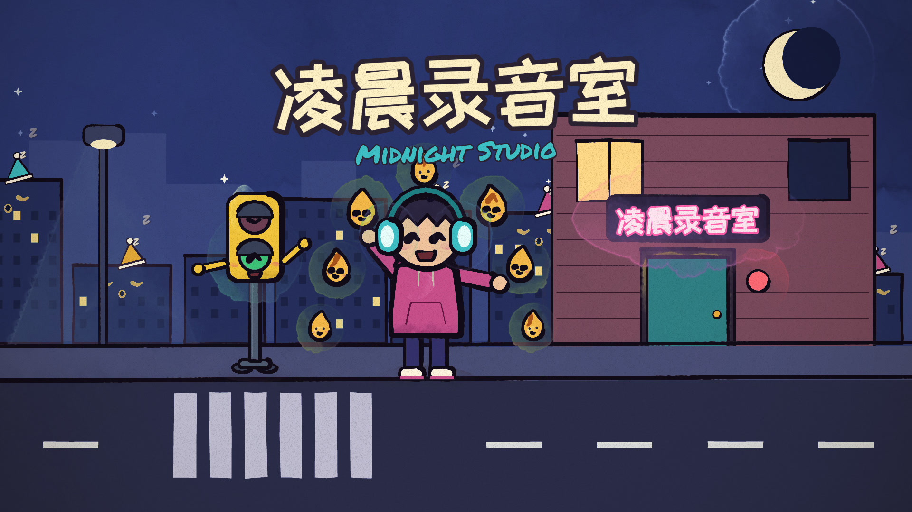
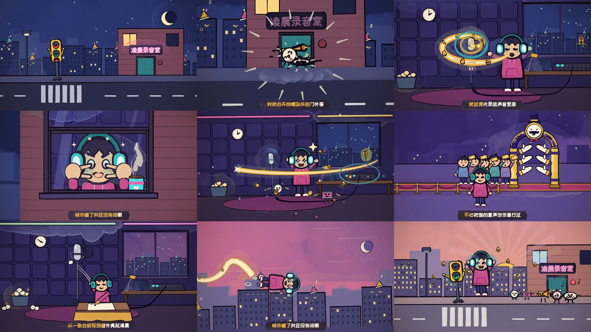
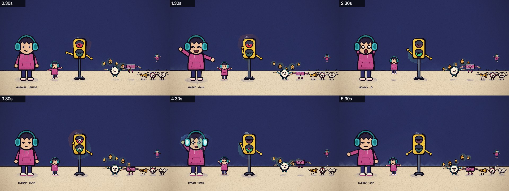

# paint-mv-skills

[](demo/midnight-studio.mp4)

给 AI Agent 用的 MV 制作 skills：输入**一首歌的音频和歌词**，输出**一支手绘水彩风格的动画 MV（MP4）**。
流程完全照 [PDoomVideo](https://github.com/JohnHeibel/PDoomVideo)（Claude 为《I'm Upping My P(doom)》画的 MV）的源码来做：
每一帧都是歌曲时间的纯函数，由 p5.js + [p5.brush](https://github.com/acamposuribe/p5.brush) 在 headless Chrome 里画成水彩与墨线，
导演写分镜、并行子代理一章一章作画、联系表检查，最后用 ffmpeg 和歌曲合成。

**画风固定，内容跟着歌词走**：水彩加墨线的绘本观感、纸纹、"沸腾"的线条、卡拉 OK 字幕、笔刷转场都沿用原作；
构思、角色、场景和道具每首歌都从歌词重新设计。

## 演示：《凌晨录音室》

用一首 86 秒的中文说唱从零跑完全流程的结果，没有人工修改画面。歌词是新写的，歌用 [YuE2](https://noiz.ai/lp/yue2) 生成。



https://github.com/user-attachments/assets/8e291eb1-0761-4abd-b2c0-7ef165dc343a

凌晨两点，全城都睡了，只有路口的红绿灯和一个戴大耳机的说唱少年还醒着。他在小录音室里把"没被听见的字"
录成一束光，每段副歌光都更大，最后冲出窗户唱进城市的耳朵里；清晨升起的太阳，就是他录了一夜的那束光。
角色全部来自歌词：唱歌的"我"小夜、"街上只剩红绿灯"的灯灯、"每个没被听见的字都还有体温"的字灵、
"耳机里的鼓点"鼓点仔、"白天的嘈杂"嘈杂怪。



分镜和全部源码在 [`demo/project/`](demo/project/)：[`STORYBOARD.md`](demo/project/STORYBOARD.md)、
角色 [`characters.js`](demo/project/src/characters.js)、共享场景 [`sets.js`](demo/project/src/sets.js)、五个章节 [`src/ch/`](demo/project/src/ch/)；
封面由 [`poster.js`](demo/project/src/poster.js) 用同一套引擎画出（`node render.mjs --loop=poster --stills=0.4`）。

## 四个 skill

| skill | 作用 |
|---|---|
| [`paint-mv`](skills/paint-mv/SKILL.md) | 总控：建项目、测节拍和对歌词时间、落地角色、给每章派子代理、统稿、出片 |
| [`paint-mv-storyboard`](skills/paint-mv-storyboard/SKILL.md) | 从歌词写分镜：构思与反转、角色表、每章场景、每句歌词一个镜头、有动机的转场 |
| [`paint-mv-animate`](skills/paint-mv-animate/SKILL.md) | 画师规范：引擎 API、按原作风格设计角色、技法目录、原作九章示例 |
| [`paint-mv-render`](skills/paint-mv-render/SKILL.md) | 联系表检查、短片、全片并行可续渲、局部重渲、编码与验收、排错 |

流程（`paint-mv` 驱动）：

1. `new_project.mjs` 建项目：引擎模板、分析节拍（BPM、首拍）、歌词转成时间轴；纯文本歌词先用 faster-whisper 自动对齐。
2. 出对拍短片确认时间。
3. 按 `paint-mv-storyboard` 从歌词写 `STORYBOARD.md`。
4. 写本片角色 `characters.js` 和共享场景 `sets.js`，出模型表。
5. 每章一个子代理并行作画，各自用联系表检查。
6. 统稿：章节交界、转场、性能。
7. 全片逐帧渲染，编码成 MP4。

## 安装

需要 Node.js ≥ 18、ffmpeg、Google Chrome、git、patch；纯文本歌词自动对齐还需要 [uv](https://docs.astral.sh/uv/)。

```bash
git clone https://github.com/lintsinghua/paint-mv-skills.git
cd paint-mv-skills
node skills/paint-mv/scripts/fetch_upstream.mjs   # 拉取原作源码（见下文「关于原作源码」）
```

把 `skills/` 下的四个目录放到你的 Agent 读取 skill 的位置，例如：

- Cursor：项目里的 `.cursor/skills/`（本仓库已经用符号链接指向 `skills/`，直接在本仓库里打开就能用）
- Claude Code：`.claude/skills/` 或 `~/.claude/skills/`（本仓库同样有符号链接）

然后对 Agent 说："用这首歌和歌词做一支 MV：`song.mp3`、`lyrics.lrc`"。

想先试试又没有合适的歌，可以像演示那样自己做一首：我是在 [YuE2](https://noiz.ai/lp/yue2) 上贴歌词生成的。

## 手动使用

```bash
# 纯文本歌词先对齐（每行一句）
uv run --python 3.12 --with faster-whisper --with zhconv python skills/paint-mv/scripts/align_lyrics.py \
    song.mp3 lyrics.txt --out lyrics.srt --lang zh

node skills/paint-mv/scripts/new_project.mjs my-mv --audio=song.mp3 --lyrics=lyrics.srt --title="歌名"
cd my-mv
# ……按 skills 写分镜、角色、章节……
node render.mjs --frames=0:<时长> --workers=4     # 逐帧渲染，可续渲
node render.mjs --encode --out=out/mv.mp4
```

复现演示：

```bash
node skills/paint-mv/scripts/new_project.mjs demo-mv --audio=demo/project/assets/song.mp3 --title="凌晨录音室"
cp -R demo/project/* demo-mv/
# 在 demo-mv/studio.html 末尾的章节注释处加上五行：
#   <script src="src/ch/c01_street.js"></script> … <script src="src/ch/c05_dawn.js"></script>
cd demo-mv && node render.mjs --frames=0:86.63 --workers=4 && node render.mjs --encode --out=out/mv.mp4
```

## 关于原作源码

PDoomVideo 仓库没有声明开源许可证，所以本仓库**不包含**它的任何文件。
`skills/paint-mv/scripts/fetch_upstream.mjs` 会从 GitHub 按固定提交拉取：

- 引擎：`core.js`、`timeline.js`、`props.js`、`clawd.js`、`cast.js`、`render.mjs`、`studio.html`；
- 原作九章：放进 `paint-mv-animate/examples/`；
- 原作分镜：放进 `paint-mv-storyboard/pdoom-storyboard.md`。

然后对引擎打上 [`template.patch`](skills/paint-mv/template.patch)：歌曲参数移到 `song.js`、支持 macOS 的 WebGL 后端、
中日韩字体和卡拉 OK 扫字速度。`new_project.mjs` 第一次运行时会自动调用它。改动细节见
[`paint-mv/SKILL.md`](skills/paint-mv/SKILL.md) 的「引擎与原作源码的差异」。

## English

Agent skills that turn a song (audio + lyrics) into a hand-painted watercolour music video, following the pipeline of
[PDoomVideo](https://github.com/JohnHeibel/PDoomVideo): a director skill that scaffolds the project, times the beat and
lyrics and briefs parallel chapter subagents; a storyboard skill that designs the concept, cast and sets from the
lyrics; an animation skill with the p5.brush engine API and the original chapters as examples; and a render skill for
headless-Chrome frame rendering and ffmpeg encoding. The style is fixed; the story and characters come from each song.
PDoomVideo's own code is not included: `fetch_upstream.mjs` downloads it at a pinned commit and applies
`template.patch`. See [`demo/`](demo/) for a full example.

## 致谢

- [PDoomVideo](https://github.com/JohnHeibel/PDoomVideo)：John Heibel，流程、引擎和画风的来源
- [p5.js](https://p5js.org/)、[p5.brush](https://github.com/acamposuribe/p5.brush)
- [LINUX DO](https://linux.do) 社区的佬友们

## 许可

本仓库的文件以 [MIT](LICENSE) 许可发布；`fetch_upstream.mjs` 下载的 PDoomVideo 源码不在此许可范围内。
